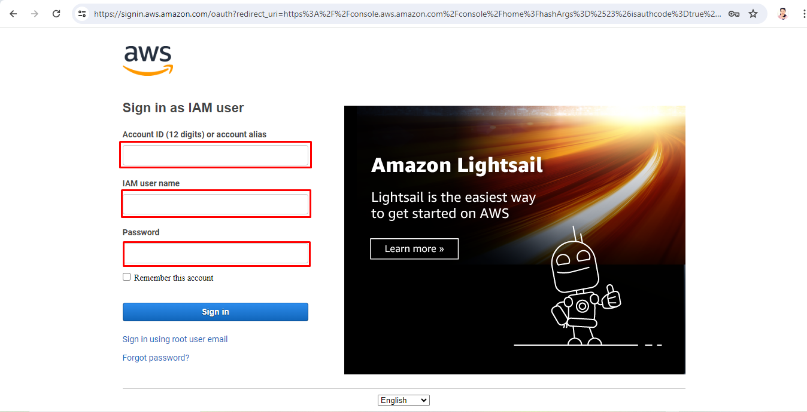

# Getting Started with AWS CloudFront

CloudFront is a content delivery network (CDN) service provided by AWS that delivers data, videos, applications, and APIs to viewers with low latency and high transfer speeds. 

**1. CloudFront:** CloudFront is like a super-fast delivery service for the content. It has many locations around the world called “edge locations.” When someone visits your website, CloudFront sends the content from the edge location closest to them, making your website load faster for them.

**2. Distribution:** A CloudFront “distribution” is like a set of instructions that tells CloudFront where your content is stored and how to deliver it to users. It specifies things like which origin server (like an S3 bucket or a web server) to get the content from and how long to cache it for.

**3. S3 Bucket:** An S3 bucket is a big digital storage container provided by AWS. You can put all kinds of stuff in it, like files, images, videos, and data. It’s like a virtual hard drive in the cloud where you can store your website’s content. When you set up a CloudFront distribution, you can tell CloudFront to get your website’s content from an S3 bucket.

**4. Regional Edge Caches:**  A larger version of an Edge location, which sits between the origin and an typical Edge location primarily to improve the performance.

# Creating an s3 bucket and CloudFront Distribution

## Introduction

This Lab guide will explain step by step procedure to you. We can use different origin for CloudFront distribution such as:

1. Amazon S3 bucket
2. Amazon S3 Object Lambda
3. Amazon S3 Access Point
4. Amazon S3 bucket that's configured as a   website endpoint
5. Add CloudFront to an existing Amazon S3 bucket
6. Change permission setting in s3 bucket.

For this lab guide we are using **Amazon S3 bucket** as the origin for a CloudFront distribution.

## Exercise 1: Sign in to the AWS Management Console

1. Open your web browser and go to the [AWS Management Console](https://console.aws.amazon.com/).
2. Sign in using your AWS account credentials.
3. Click on sign in.

    