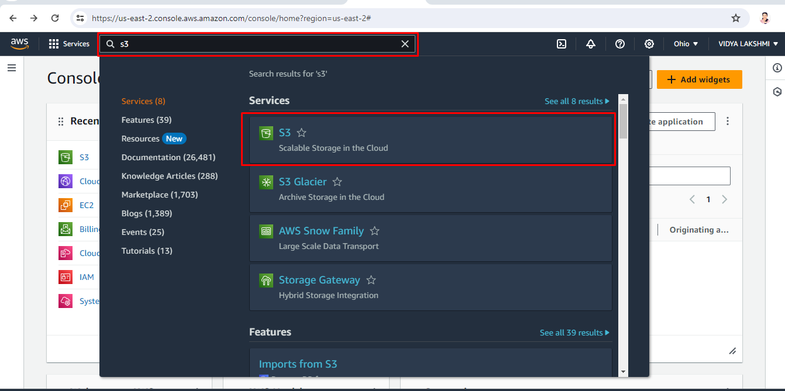

## Exercise 2: Navigate to the search bar and search S3

1. Once logged in, you'll land on the AWS Management Console Dashboard.
2. In the search bar at the top, Search for **S3**.
3. Click on **S3** in the dropdown as shown.

