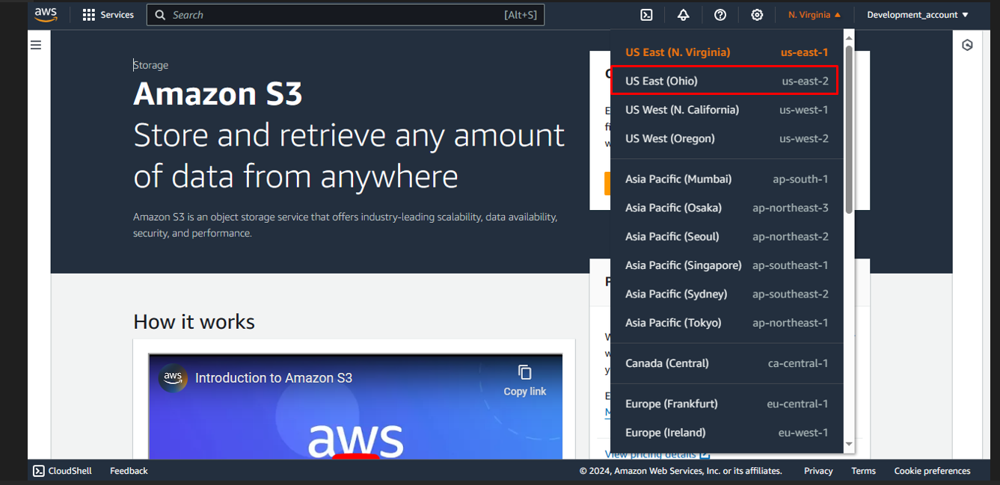
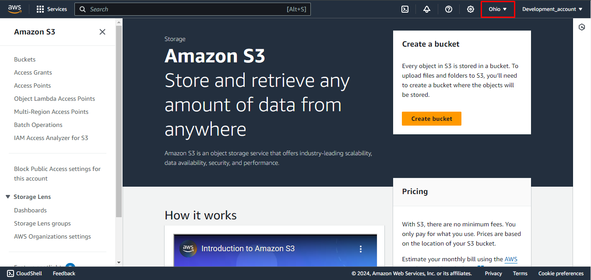
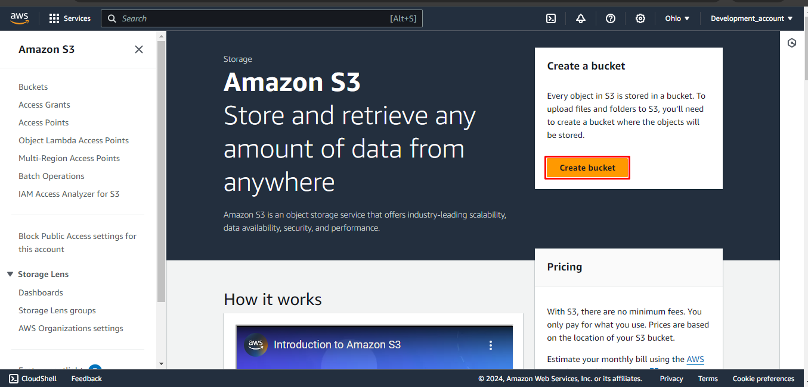
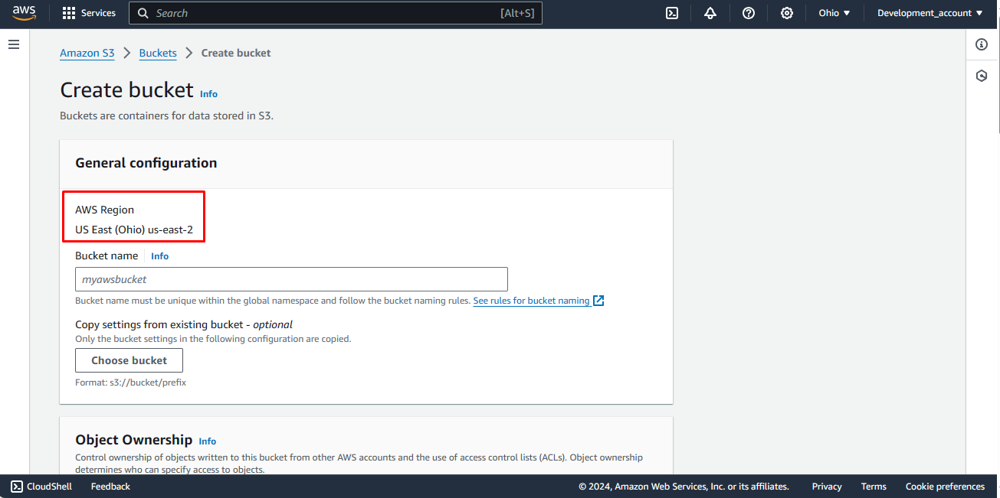
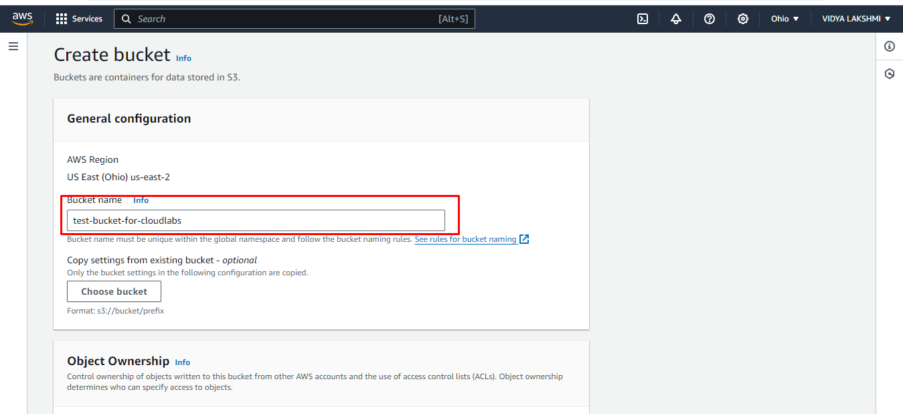
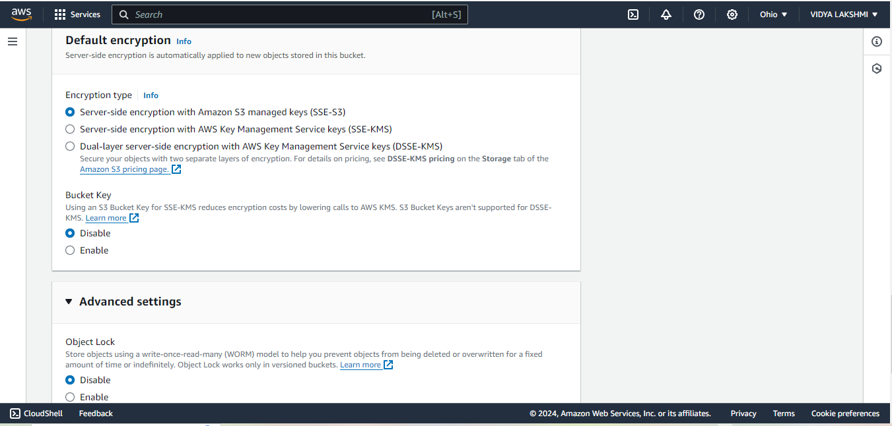
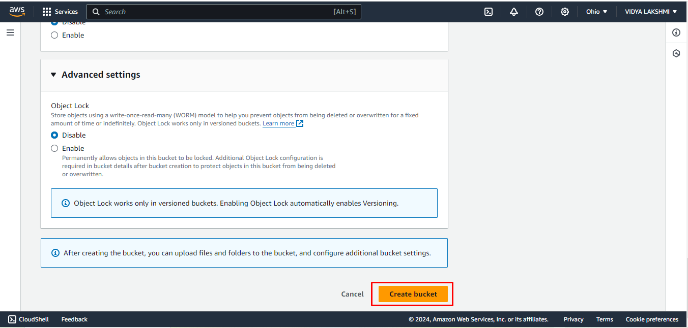
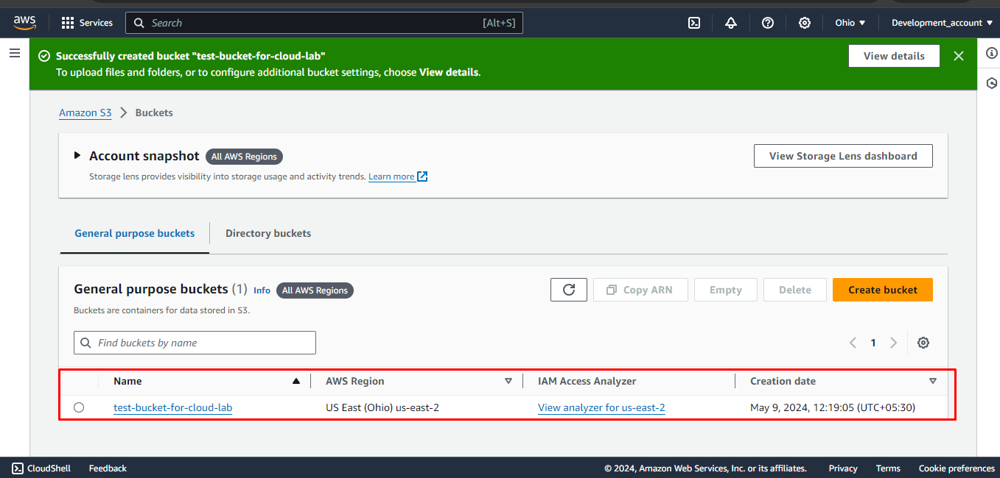

## Exercise 3: Create a Bucket

1. You'll land on the s3 console, there on top right corner you will see **region** and the dropdown button, choose the region.

You will observe that the region is changed to Ohio.

Note: This region will be the origin of your file.

2. In the S3 dashboard, click on **create Bucket** .

3. You will be redirected on this page and you can check the region here.

4. Enter a unique bucket name. Bucket names must be unique across all existing bucket names in Amazon S3.

    **Note:**  If the bucket name is not unique, it will show error in the end. (Bucket name should only be in lowercase letters, numbers, dots (.), and hyphens (-))

> Example: test-bucket-for-cloudlabs

5. Leave the remaining things as default.

6. Click on the **Create Bucket**

7. You will see that your s3 bucket is created.

