## Exercise 4: Insert an Object in the Bucket

>   https://github.com/VidyaLakshmi3110/labguide/raw/main/hello-world-html%20(2).zip

  Unzip this file and save the css folder and index file in the desktop.

1. Click on the bucket name to go inside the Bucket.

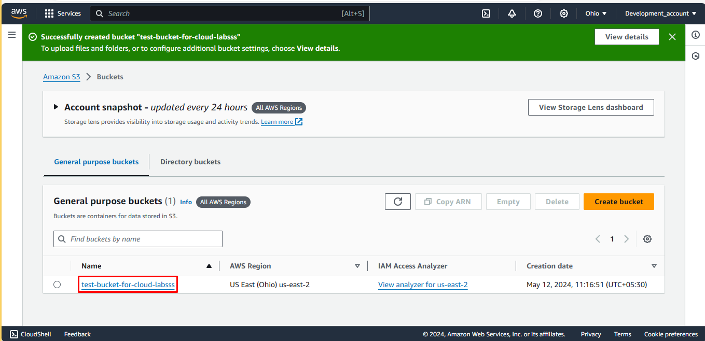

2. Click on **upload**

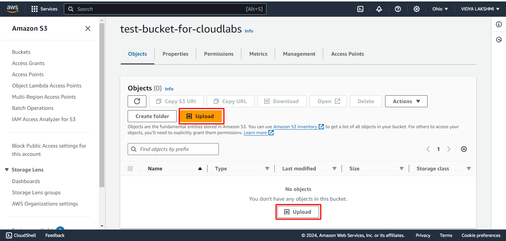

3. Click on **Add files**

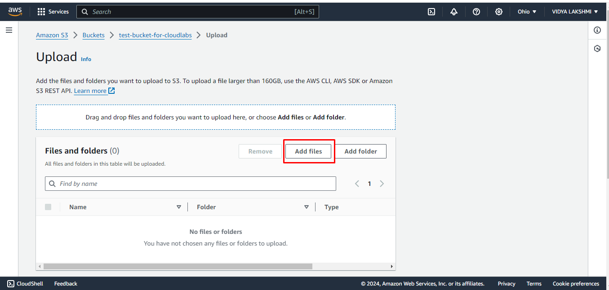

4. Select the **index.html** file that you downloaded above.

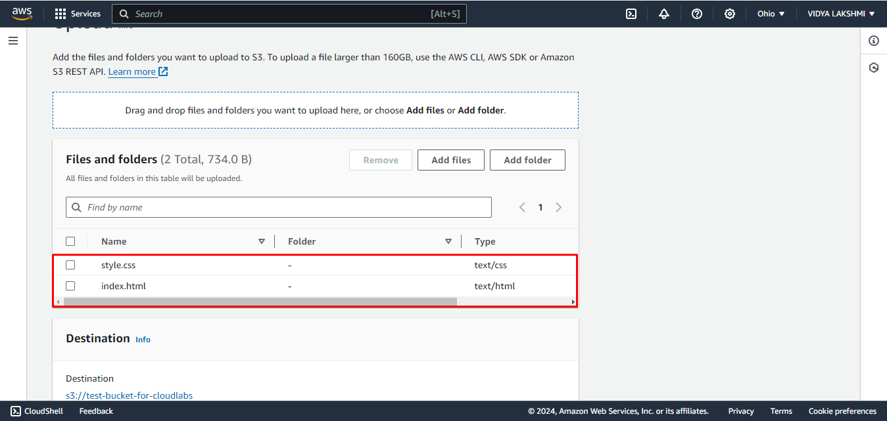

5. Scroll down and Click on **upload**.

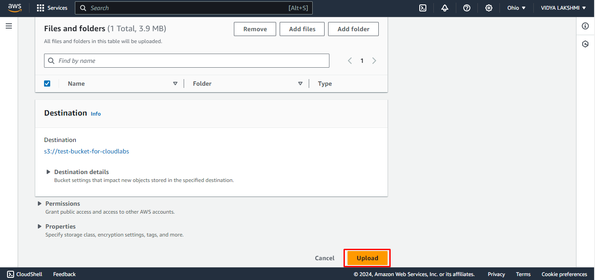

6. The Object is now stored in the Bucket.

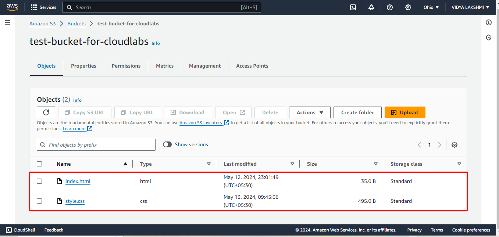

7. Scroll up and go to **properties** and click on it.

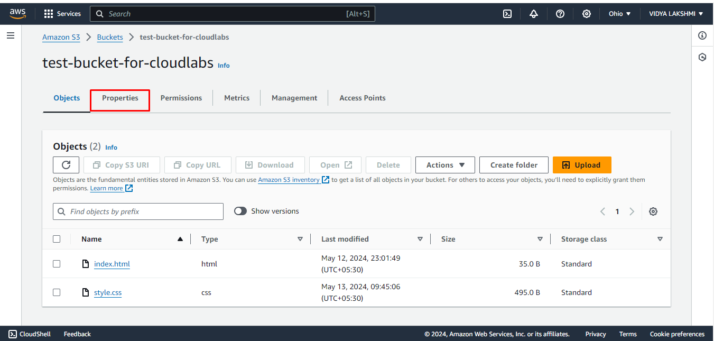

8. Scroll down till the end. In **Static website hosting** you will see that it is diabled, click on **Edit**

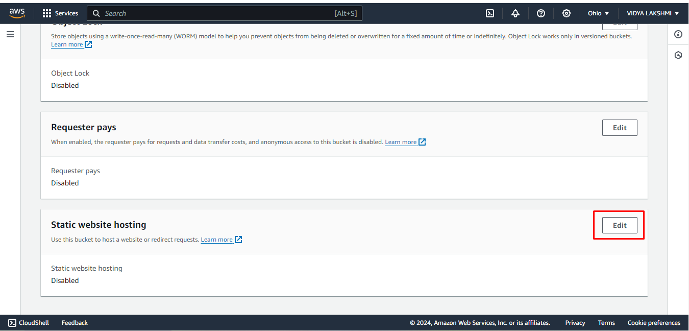

9. Click on **Enable**.

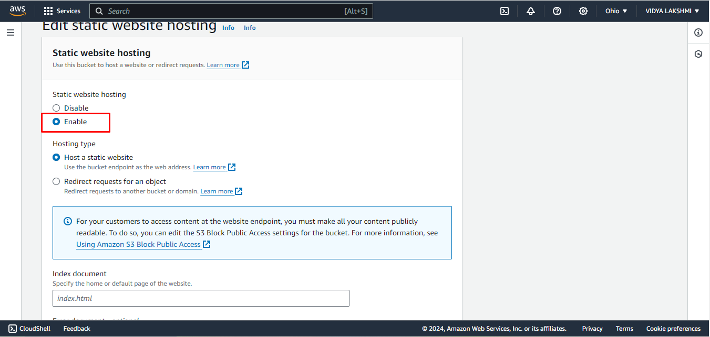

10. Scroll down and in index and error document write **"index.html"**

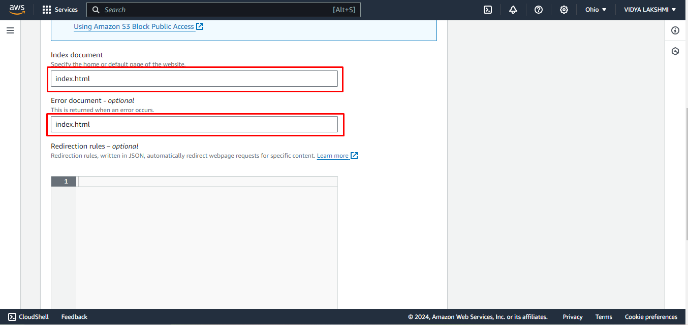

11. Click on **save changes**

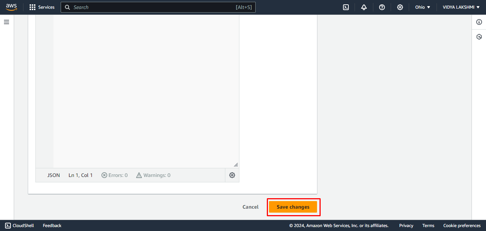