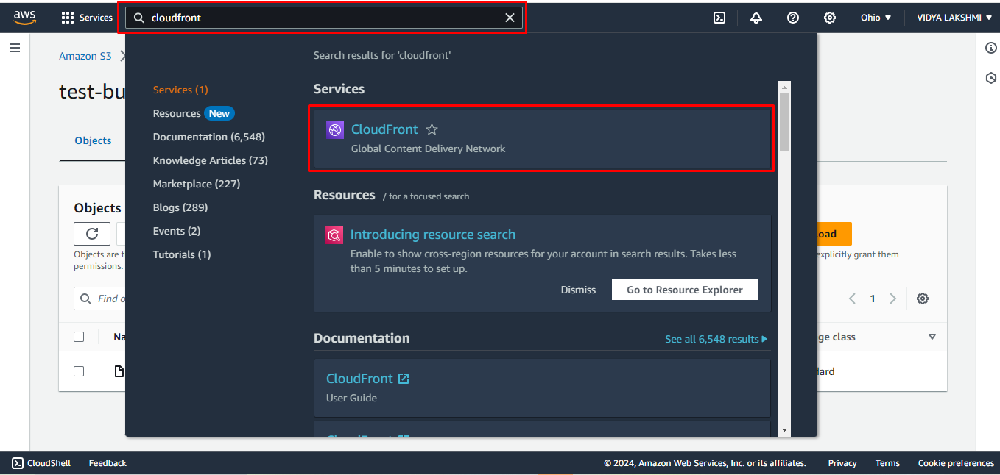
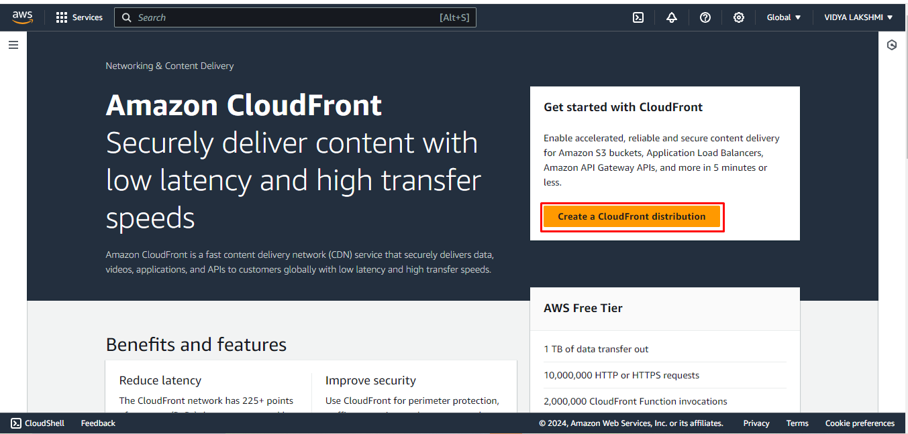
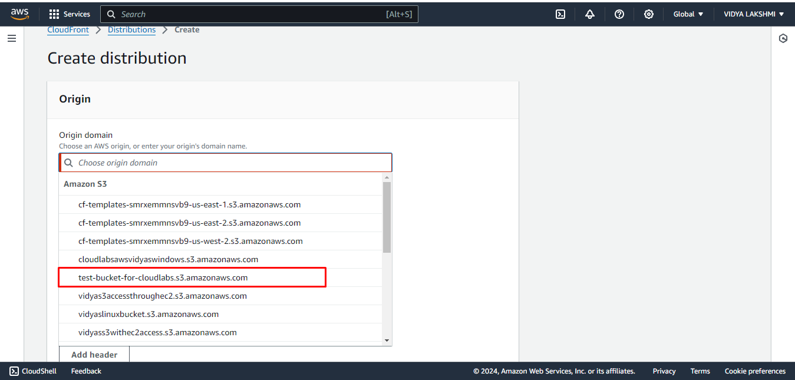
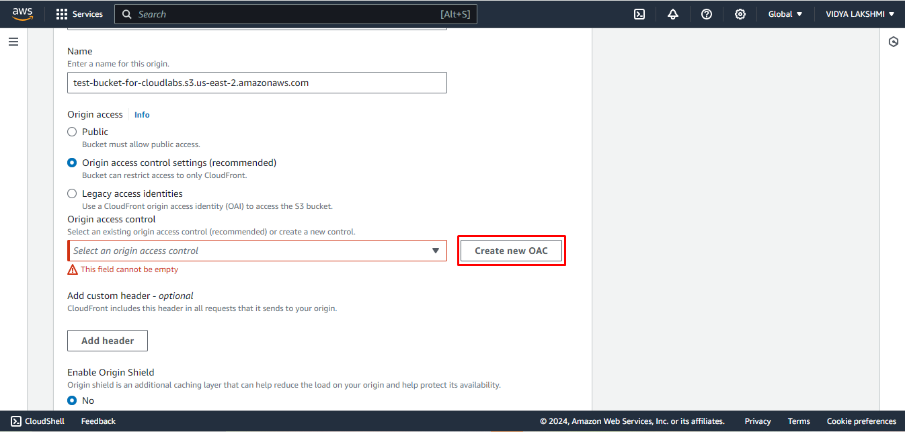
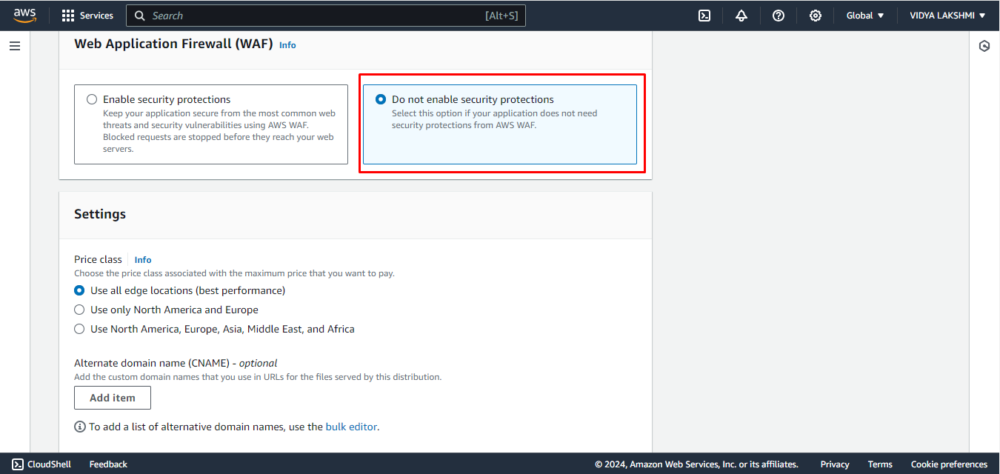
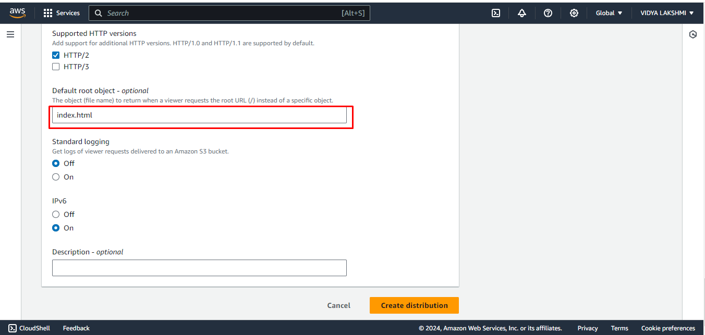
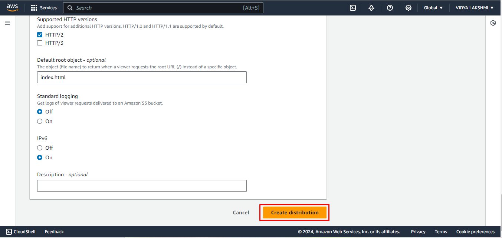
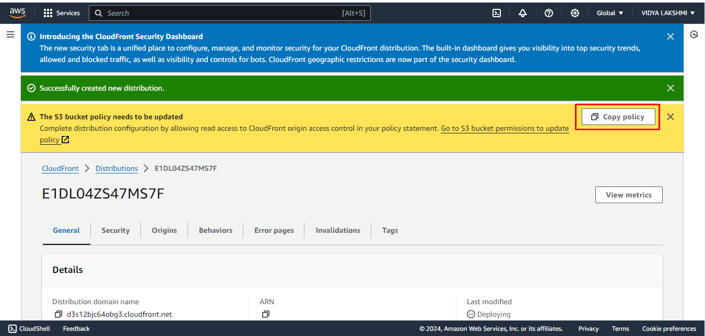
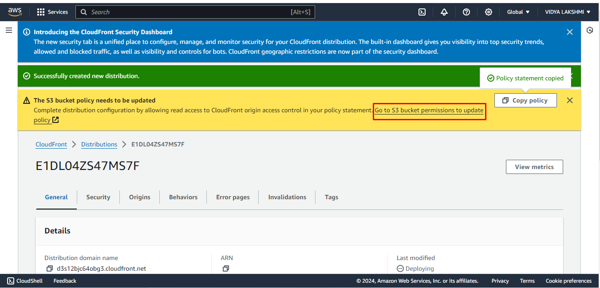

## Exercise 5: Navigate to the search bar and search CloudFront

1. In the search bar at the top, Search for **CloudFront**.
2. Click on **CloudFront** in the dropdown as shown.

3. Select **Create a CloudFront distribution**.

4. In Origin domain select the name of the S3 bucket you stored.

5. Scroll down and Choose **Origin access control settings**
Click on **Create new OAC**

7. Scroll down and in (WAF) Click on **Do not create security protections**

7. Scroll down and in **Default root object** write **"index.html"**

8. Click on **Create Distribution**

9. In The S3 bucket policy needs to be updated banner click on **Copy policy**

10. In the same banner, choose the link to **Go to S3 bucket permissions to update policy**. (This takes you to your bucket detail page in the Amazon S3 console.)

