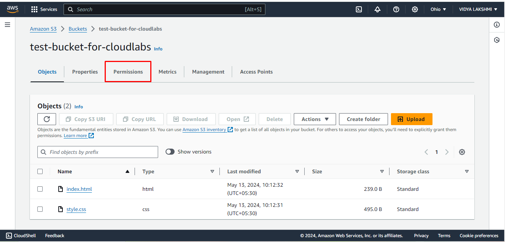
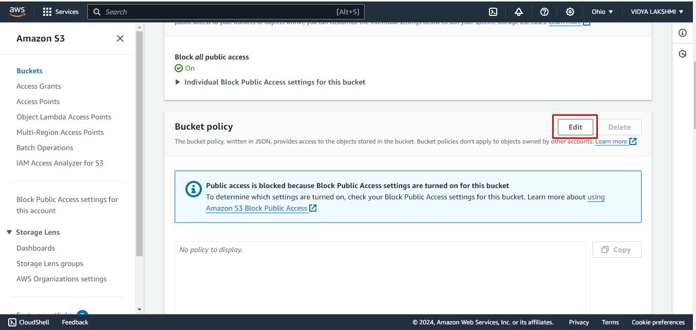
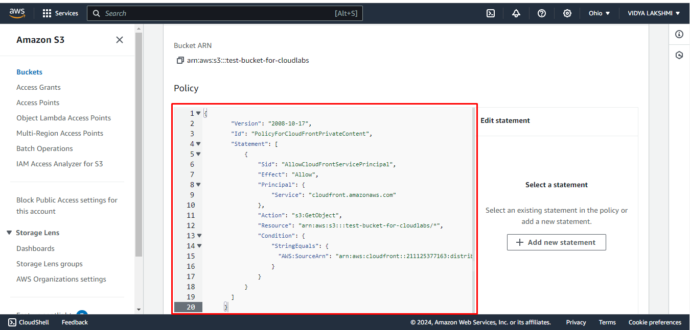
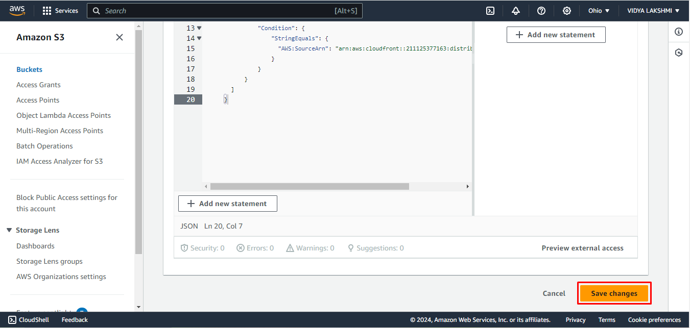
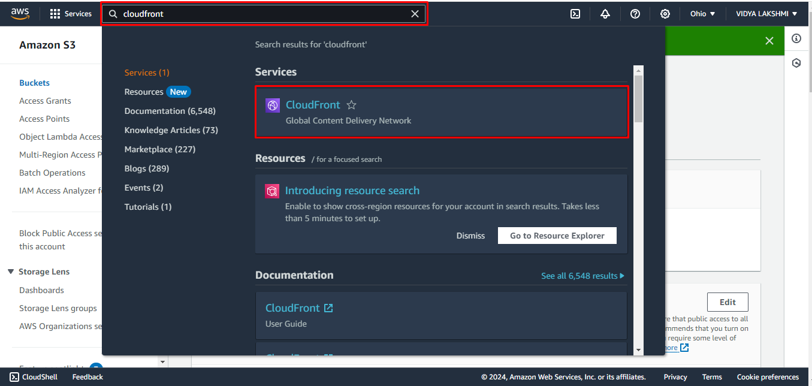
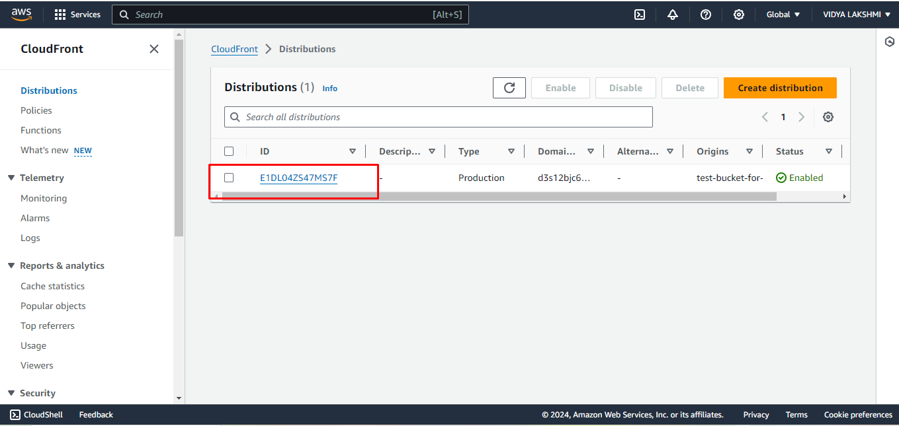
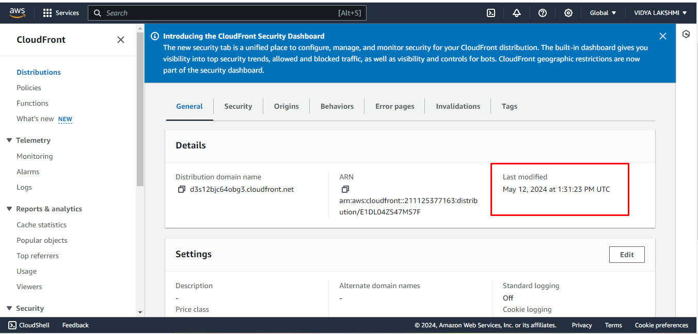
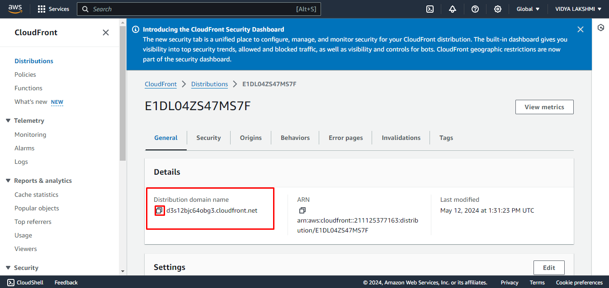
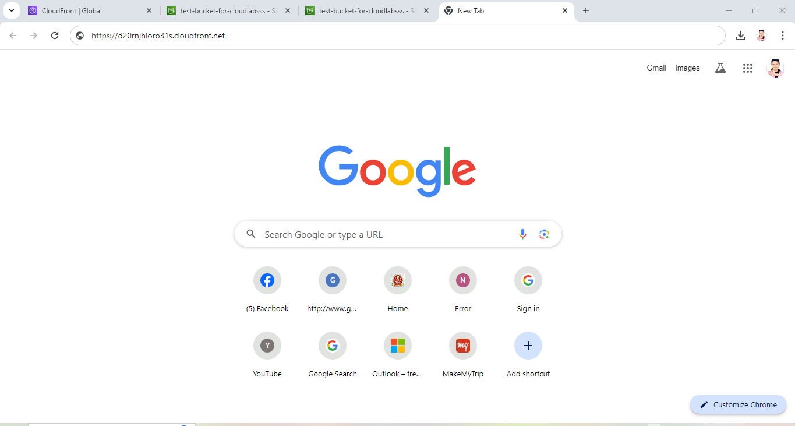
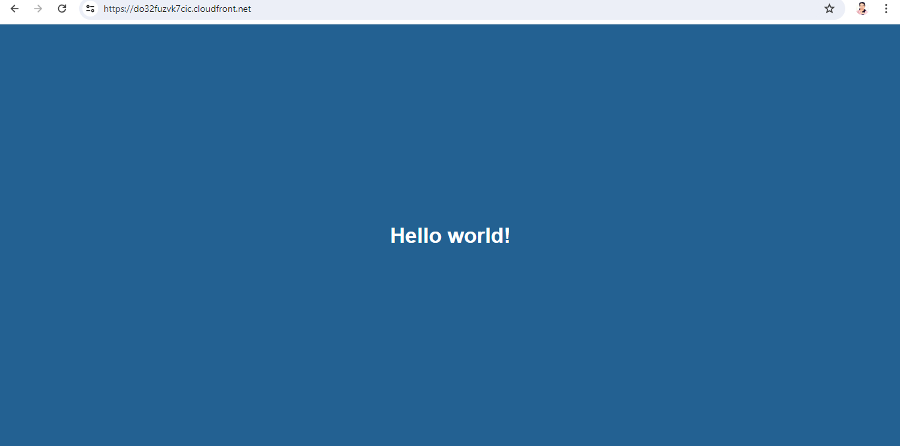

## Exercise 6: Change permission setting in s3 bucket.

1. Now you are inside the bucket, click on **Permissions**

2. Scroll down and in Bucket policy, choose **Edit**.

3. Paste the policy that you copied.

4. Click on **Save Changes**

5. Navigate back to the CloudFront dashboard(previous tab). 

6. Click on the distribution name.

7. Wait till the status in the **Last Modified** changes to Date and time.

8. Copy the **Distribution Domain Name**

9. Paste it in new tab.

10. After copying the url, paste it in your browser you should see a default webpage saying "Hello World" as shown in the screenshot.

Congratulations!! You have successfully completed the lab!
